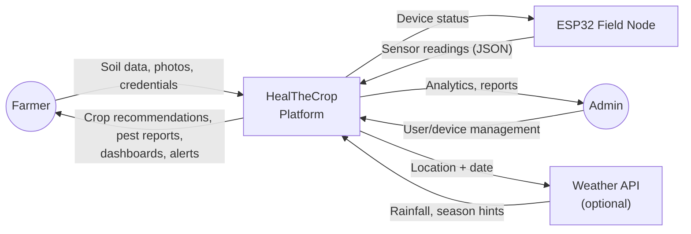
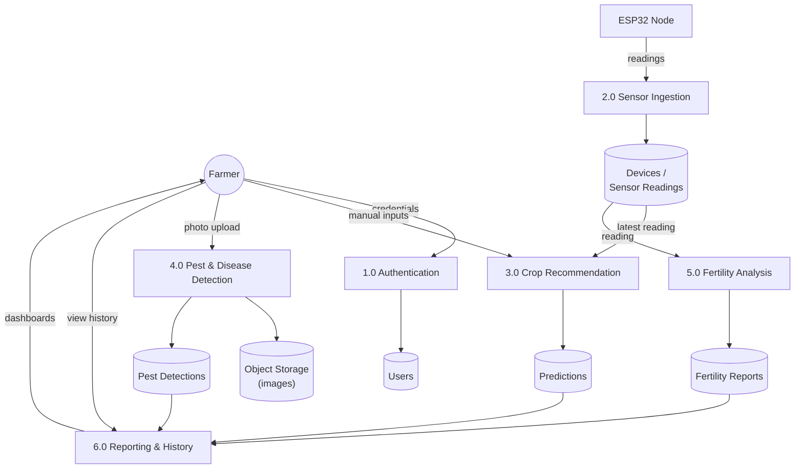
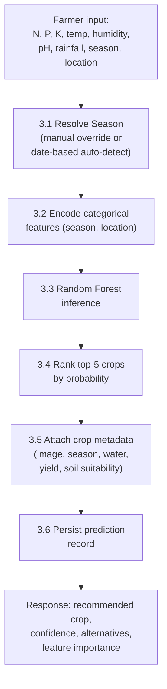
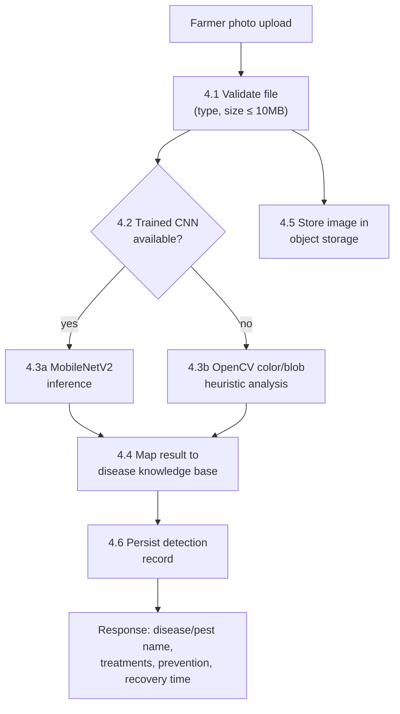

# Data Flow Diagrams

## DFD Level 0 (Context Diagram)

## DFD Level 1 (Major Processes)

## DFD Level 2 — Crop Recommendation (3.0) expanded

## DFD Level 2 — Pest & Disease Detection (4.0) expanded

