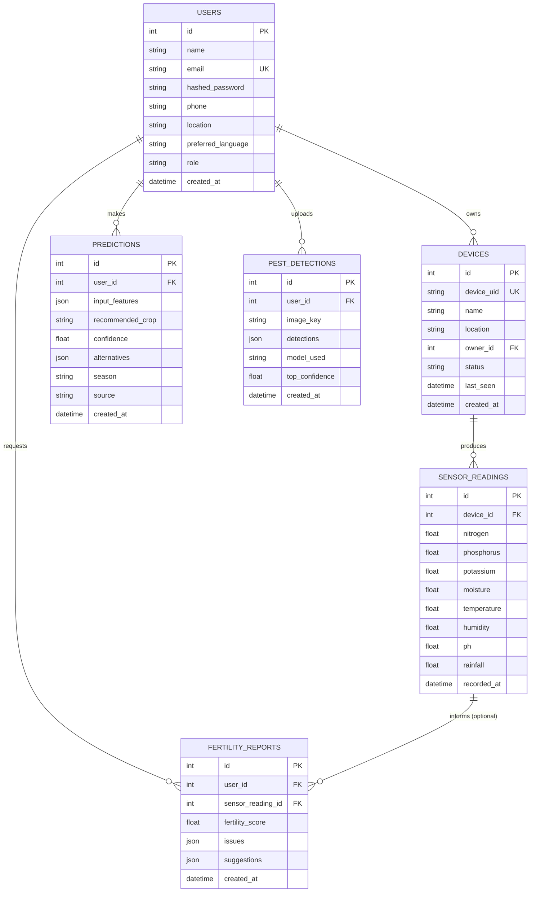

# Entity-Relationship Diagram

See [Database Schema](database_schema.md) for column-level detail.

```mermaid
erDiagram
    USERS ||--o{ DEVICES : owns
    USERS ||--o{ PREDICTIONS : makes
    USERS ||--o{ PEST_DETECTIONS : uploads
    USERS ||--o{ FERTILITY_REPORTS : requests
    DEVICES ||--o{ SENSOR_READINGS : produces
    SENSOR_READINGS ||--o{ FERTILITY_REPORTS : "informs (optional)"

    USERS {
        int id PK
        string name
        string email UK
        string hashed_password
        string phone
        string location
        string preferred_language
        string role
        datetime created_at
    }

    DEVICES {
        int id PK
        string device_uid UK
        string name
        string location
        int owner_id FK
        string status
        datetime last_seen
        datetime created_at
    }

    SENSOR_READINGS {
        int id PK
        int device_id FK
        float nitrogen
        float phosphorus
        float potassium
        float moisture
        float temperature
        float humidity
        float ph
        float rainfall
        datetime recorded_at
    }

    PREDICTIONS {
        int id PK
        int user_id FK
        json input_features
        string recommended_crop
        float confidence
        json alternatives
        string season
        string source
        datetime created_at
    }

    PEST_DETECTIONS {
        int id PK
        int user_id FK
        string image_key
        json detections
        string model_used
        float top_confidence
        datetime created_at
    }

    FERTILITY_REPORTS {
        int id PK
        int user_id FK
        int sensor_reading_id FK
        float fertility_score
        json issues
        json suggestions
        datetime created_at
    }
```
