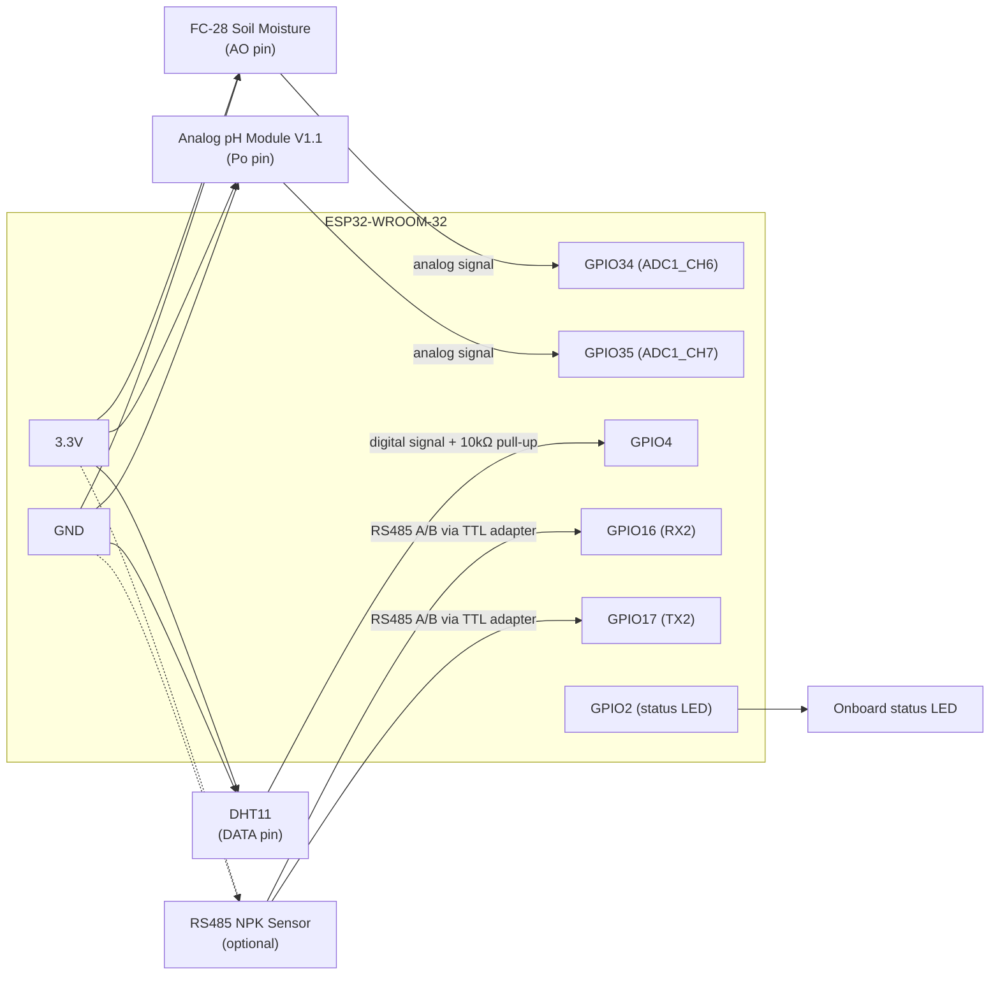

# Hardware Wiring & Circuit Diagram

Full setup instructions: [`esp32/README.md`](../esp32/README.md). This page is the visual
reference.

## Components

- ESP32-WROOM-32 DevKit
- FC-28 Soil Moisture Sensor (analog)
- DHT11 Temperature & Humidity Sensor
- Analog pH Sensor Module V1.1
- (Optional) RS485 Modbus 7-in-1 NPK soil sensor
- 10kΩ pull-up resistor (DHT11 data line, if your breakout board doesn't already include one)

## Wiring Diagram

## Pin reference table

| ESP32 Pin | Function | Connects to |
|---|---|---|
| GPIO34 (ADC1_CH6) | Analog in | FC-28 AO |
| GPIO35 (ADC1_CH7) | Analog in | pH sensor Po |
| GPIO4 | Digital I/O | DHT11 DATA (+ 10kΩ pull-up to 3.3V) |
| GPIO16 | UART2 RX | RS485-to-TTL adapter TX (NPK, optional) |
| GPIO17 | UART2 TX | RS485-to-TTL adapter RX (NPK, optional) |
| GPIO2 | Digital out | Onboard status LED |
| 3.3V | Power | All sensor VCC pins |
| GND | Ground | Common ground for all sensors |

## Power notes

- FC-28 and the pH probe are corrosive-prone if powered continuously in soil. For a
  permanent field deployment, switch their VCC through a spare GPIO + transistor and only
  power them briefly before each reading (see "Future Scope" for the low-power variant —
  the firmware shipped here assumes always-on power for simplicity).
- Use a common ground between the ESP32 and every sensor, or analog readings will be noisy
  or meaningless.

## Calibration

- **FC-28**: record the raw ADC value fully dry (in air) and fully wet (submerged in
  water), then set `SOIL_ADC_DRY` / `SOIL_ADC_WET` in `esp32/HealTheCrop_Firmware/config.h`.
- **pH sensor**: use pH 4.0 and 7.0 buffer solutions, record the measured voltage at each,
  and set `PH_VOLTAGE_4` / `PH_VOLTAGE_7` in `config.h`.
