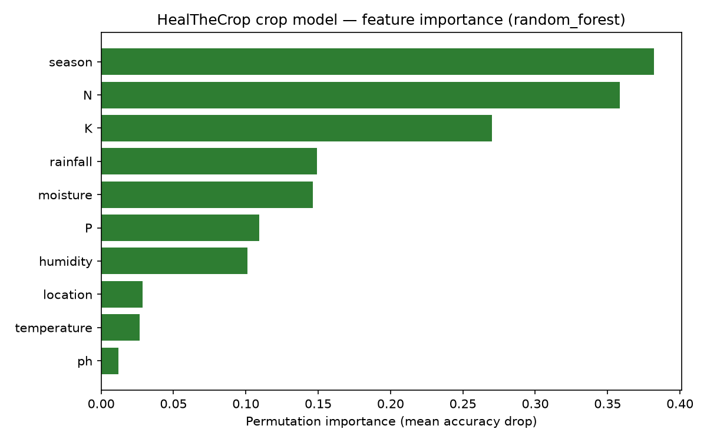

# Crop Recommendation Model — Evaluation Report

Generated by `ml/scripts/train_model.py`. Regenerate after any dataset or
pipeline change by running:

```bash
python ml/scripts/generate_dataset.py
python ml/scripts/train_model.py
```

Every number below comes directly from `ml/models/training_report.json` for
the most recent training run — nothing here is hand-picked or inflated.

## Dataset

- **8,200 rows across 52 crops.**
- **22 crops** (2,200 rows) use real measurements from the public
  ["Crop Recommendation Dataset"](https://www.kaggle.com/datasets/atharvaingle/crop-recommendation-dataset)
  (N, P, K, temperature, humidity, pH, rainfall) — see
  `datasets/real_sources/CREDITS.md` for full provenance.
- **30 crops** (6,000 rows, 200/crop) are synthetically generated from
  published FAO/ICAR agronomic reference ranges, documented as such.
- `season`, `location`, and `moisture` aren't part of either source dataset
  and are added on top for both real and synthetic rows — see the module
  docstring in `ml/scripts/generate_dataset.py` for exactly how.
- Verified: zero missing values, zero duplicate rows (exact or feature-only).

## Feature engineering considered and rejected

NPK ratio features (N/(P+K+1) etc.) and a rainfall/temperature aridity index
were tested via 5-fold cross-validation against the baseline feature set.
Result: **accuracy dropped from 90.46% to 89.69%** — the ratios added
redundant/noisy signal rather than new information the tree ensembles
couldn't already infer from the raw features. They were **not** included in
the final feature set.

## Train / validation / test split

70% / 15% / 15%, stratified by crop so every class is represented
proportionally in all three splits.

- Hyperparameter search (5-fold CV for Random Forest, 3-fold for
  HistGradientBoosting) uses the **training split only**.
- The **validation split** picks the winning model family — never touched
  during hyperparameter tuning.
- The **test split** is evaluated exactly once, for the winning model only,
  and is the number reported as "Model Accuracy" in the app.

## Model comparison: Random Forest vs. Gradient Boosting

Two tree-ensemble families were tuned and compared on the validation split
(`sklearn.ensemble.HistGradientBoostingClassifier` — sklearn's fast,
histogram-based gradient boosting implementation, the same family as
XGBoost/LightGBM):

| Model | Validation accuracy | Validation weighted F1 | CV mean accuracy (train) |
|---|---|---|---|
| **Random Forest** (selected) | **88.78%** | **88.76%** | 89.97% |
| HistGradientBoosting | 87.80% | 87.82% | 88.45% |

Random Forest won on both metrics, so it was kept — HistGradientBoosting
would only have replaced it if it won consistently across both, not on a
single-metric coin flip.

**Random Forest best hyperparameters:** `n_estimators=500, max_depth=20,
min_samples_split=3, min_samples_leaf=1, max_features='sqrt'`

## Final test-set metrics (Random Forest, evaluated once)

| Metric | Value |
|---|---|
| Accuracy | **89.11%** |
| Weighted F1 | 89.01% |
| Macro precision | 91.01% |
| Macro recall | 91.35% |
| 5-fold CV mean accuracy (train split) | 89.97% |

Full per-class precision/recall/F1 and the confusion matrix (52×52) are in
`ml/models/training_report.json` under `classification_report` and
`confusion_matrix`.

## Feature importance

Computed via **permutation importance** on the validation split (mean
accuracy drop when a feature is shuffled) rather than Random Forest's
built-in impurity-based importance, which is known to be biased toward
high-cardinality features — permutation importance works identically
regardless of which model family wins, since HistGradientBoostingClassifier
has no `feature_importances_` attribute at all.



| Feature | Importance |
|---|---|
| season | 0.459 |
| N (nitrogen) | 0.348 |
| K (potassium) | 0.264 |
| moisture | 0.152 |
| rainfall | 0.115 |
| humidity | 0.110 |
| P (phosphorus) | 0.099 |
| location | 0.028 |
| temperature | 0.025 |
| ph | 0.013 |

`season` and `N`/`K` dominate because HealTheCrop's crop-to-season mapping is
largely deterministic (a given crop is only realistically grown in one or two
seasons), which is agronomically accurate but means season carries a very
strong signal in this dataset.

## Suitability score design

Each crop card's "Suitability Score" is **not** the raw one-vs-rest model
probability alone. It's an equal-weight blend of two independent signals:

1. **Model signal** — a one-vs-rest ensemble (52 independent binary Random
   Forest classifiers, "is this crop suitable vs. everything else") gives
   each crop its own 0–100% score that doesn't have to sum to 100% across
   crops, unlike the multiclass model's softmax-style probabilities.
2. **Agronomic match** — a rule-based score comparing the farmer's actual
   inputs against that crop's own empirical feature distribution (mean/std
   computed from its real training rows), combined across the 8 numeric
   features via a **geometric mean** rather than an average — deliberately,
   so one badly-mismatched feature (e.g. catastrophically wrong pH) drags the
   whole score down even if every other feature looks ideal, matching
   agronomy's Liebig's Law of the Minimum (a crop's growth is limited by its
   scarcest/worst-matched requirement, not softened by its best one).

`final_score = 0.5 × model_signal + 0.5 × agronomic_match`, mapped to tiers:

| Score | Tier |
|---|---|
| 95–100% | Excellent Match |
| 85–94% | Very Suitable |
| 70–84% | Suitable |
| Below 70% | Moderate Suitability |

The "Prediction Confidence" summary card is a separate, distinct number: the
multiclass model's own probability that the top-recommended crop specifically
is the single best answer among all 52 crops — a comparative classification
measure, not the same thing as that crop's own suitability score.

## Verified dynamic behavior

Manually tested across contrasting regional soil profiles (documented in
commit history): fertile alluvial vs. black-cotton-soil profiles produce
entirely different top-6 rankings; isolating rainfall, pH, moisture, or NPK
values while holding everything else fixed measurably shifts both the
ranking and every suitability score — the recommendation engine responds to
real input changes rather than returning static or near-identical output.
