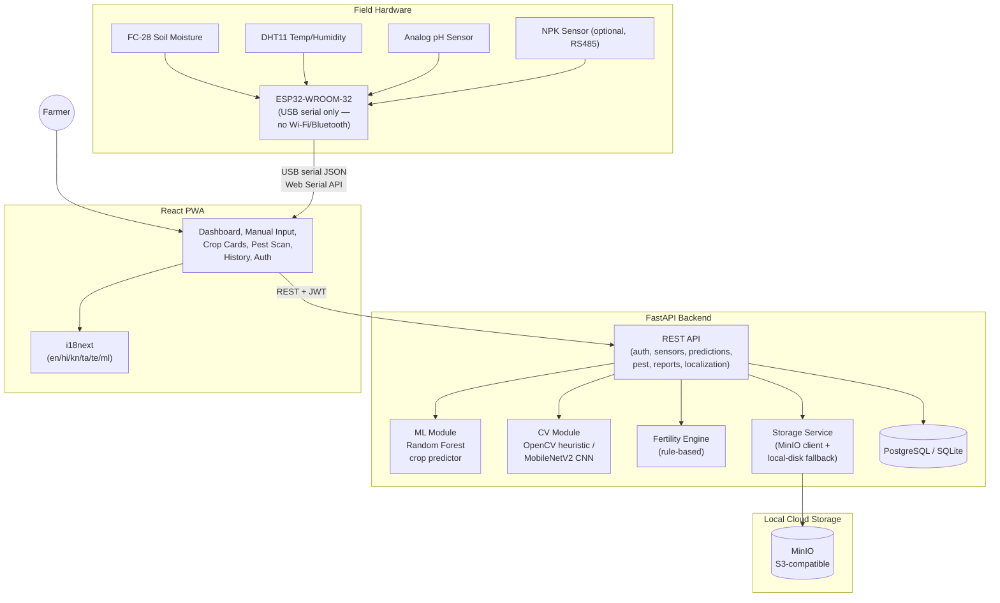

# System Architecture

## Component responsibilities

- **ESP32 firmware** reads sensors on a fixed interval, tolerates individual sensor failures
  (sends `null` for that field rather than aborting), and communicates exclusively over USB
  serial — no Wi-Fi or Bluetooth. The browser reads the serial output directly (Web Serial
  API) and is the one that POSTs it to the backend.
- **Backend API** is organized into modules mirroring the spec's required separation:
  `auth`, `sensors`, `predictions` (ML), `pest` (CV), `reports` (fertility), `localization`,
  plus core `storage`/`database`/`security` concerns.
- **ML module** loads a pre-trained Random Forest bundle (`ml/models/crop_model.joblib`) once
  per process and serves predictions synchronously (sub-millisecond inference).
- **CV module** prefers a trained CNN if present, otherwise uses an always-available OpenCV
  color/blob heuristic — see [`backend/app/cv/`](../backend/app/cv/).
- **Storage service** talks to MinIO when reachable; transparently falls back to local disk
  otherwise, so development never blocks on having MinIO running.
- **Frontend** is a single-page React app with client-side routing, JWT stored via a
  persisted Zustand store, and full runtime language switching via i18next.
