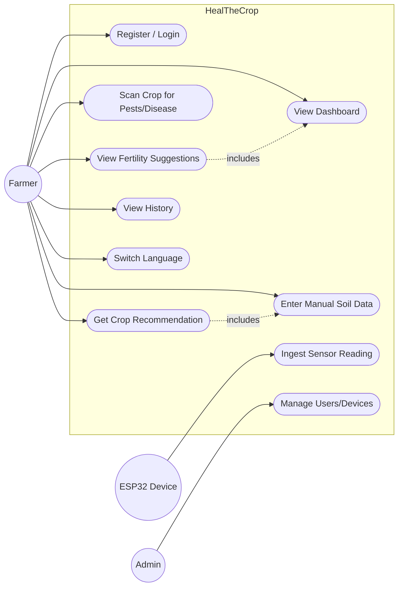
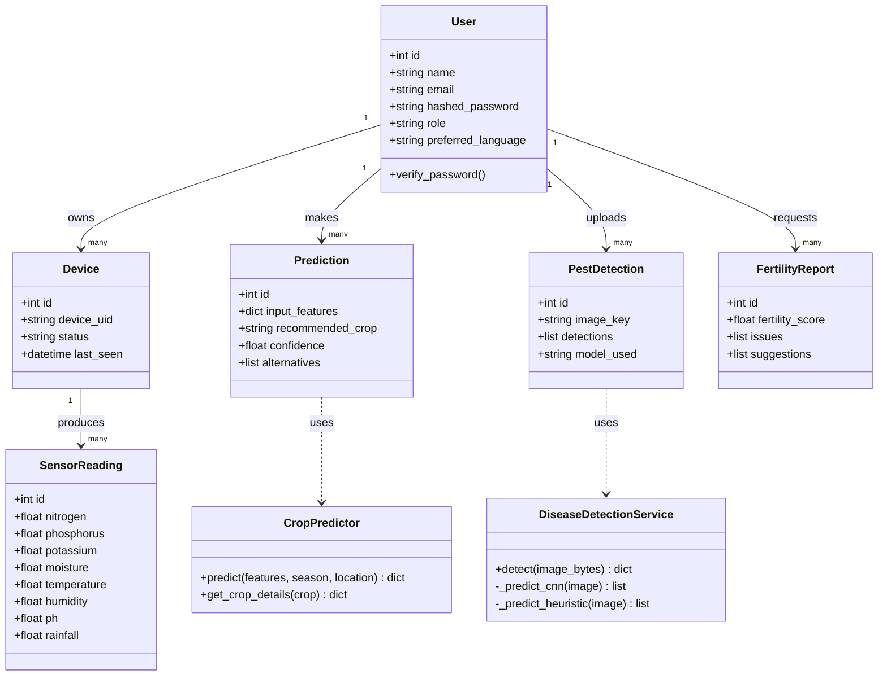
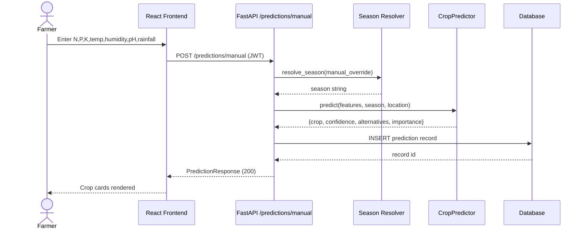
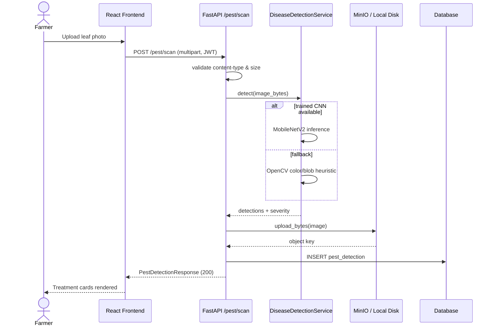
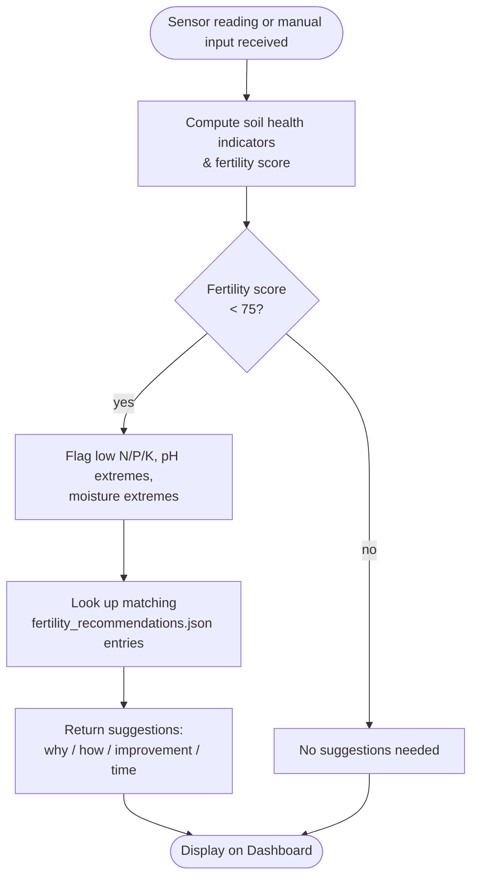

# UML Diagrams

## Use Case Diagram

## Class Diagram (core domain model)

## Sequence Diagram — Manual Crop Recommendation

## Sequence Diagram — Pest Scan

## Activity Diagram — Fertility Improvement Flow

